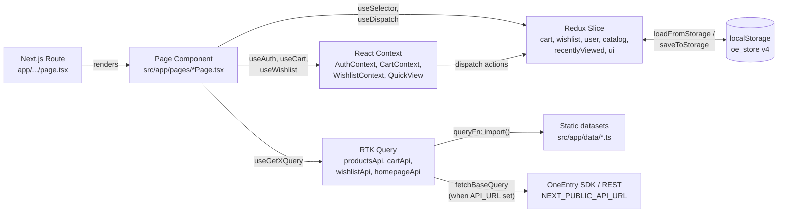

# Architecture — new-shop-nextjs

High-level architecture overview of the playground e-commerce storefront. Optimized for LLM consumption: short, technical, file-cited.

This document is the top of the documentation pyramid. For deep dives see:
- [DATASETS.md](./DATASETS.md) — the static dataset layer (`src/app/data/`)
- [REDUX.md](./REDUX.md) — Redux Toolkit + RTK Query layer in detail
- [E2E-TESTS.md](./E2E-TESTS.md) — Playwright suite organization
- [AUTH.md](./AUTH.md) — authentication flow + token model
- [ONEENTRY_INTEGRATION.md](./ONEENTRY_INTEGRATION.md) — what is real vs mocked against the Platform
- [CART_WISHLIST.md](./CART_WISHLIST.md) — cart/wishlist state, sync, persistence
- [CHECKOUT.md](./CHECKOUT.md) — three-step funnel, coupon flow, pricing
- [CATALOG_FILTERS.md](./CATALOG_FILTERS.md) — catalog filter engine + variant selection
- [I18N.md](./I18N.md) — locale infrastructure (effectively English-only today)
- [PWA.md](./PWA.md) — service worker + manifest

---

## 1. Tech stack

Sourced from `package.json:19-58`.

| Layer | Library | Version |
|---|---|---|
| Framework | `next` | ^16.2.1 (App Router, React Server Components) |
| UI runtime | `react` / `react-dom` | ^19.2.6 |
| State (client) | `@reduxjs/toolkit` | ^2.11.2 |
| State (binding) | `react-redux` | ^9.2.0 |
| Server cache | `@reduxjs/toolkit/query/react` (RTKQ, bundled with RTK) | — |
| Validation | `zod` | ^4.3.6 |
| Styling | `tailwindcss` + `@tailwindcss/postcss` | ^4.3.0 |
| Icons | `@heroicons/react`, `lucide-react` | — |
| Animation utils | `tw-animate-css` | — |
| Diagrams (build-time) | `mermaid`, `remark-gfm` | — |
| Unit tests | `vitest` + `@testing-library/react` + `jsdom` | ^4.1.2 / ^16.3.2 |
| E2E tests | `@playwright/test` / `playwright` | ^1.60.0 |
| Storybook | `storybook` + `@storybook/nextjs-vite` | ^10.3.4 |
| Lint | `eslint` 9 + `eslint-config-next` | — |

Node target: ES2017 (`tsconfig.json:3`). Module resolution: `bundler`. Path alias: `@/*` → `./src/*` (`tsconfig.json:25-28`).

**Notable absences (intentional for the playground):** no `next-intl` (i18n is dataset-driven label maps), no `next-auth` (auth lives in Server Action + Context + Redux), no ORM/database driver (data comes from static TS files in `src/app/data/` or from a remote OneEntry Platform via RTK Query when `NEXT_PUBLIC_API_URL` is set), **no analytics SDK** (`gtag` / `gtm` / `fbq` / `posthog` / `amplitude` / `mixpanel` / `segment` are all absent from `src/` and `app/` — verified by grep). Page views, add-to-cart, and purchase events are not tracked anywhere. Adding analytics would be a new integration, not a configuration toggle.

---

## 2. Directory map

The project uses **dual roots**: `app/` (Next.js routes) and `src/app/` (the actual implementation tree).

### `app/` — Next.js App Router only

`app/` contains only **route entry points** — `page.tsx`, `layout.tsx`, route segment configs, error boundaries, metadata helpers. The route shells delegate to page components imported from `src/app/pages/`.

| Path | Purpose |
|---|---|
| `app/layout.tsx` | Root layout — metadata, viewport, `<Providers>` wrap (`app/layout.tsx:1-104`) |
| `app/page.tsx` | Home — JSON-LD organisation/website schema + `<HomePage />` (`app/page.tsx:78-86`) |
| `app/[...slug]/page.tsx` | Catch-all — catalog/info pages dispatched via `PAGE_REGISTRY` (`app/[...slug]/page.tsx:97-140`) |
| `app/account/page.tsx` | Account dashboard (login-gated) |
| `app/cart/page.tsx` | Cart |
| `app/checkout/{delivery,payment,confirmation}/page.tsx` | Three-step checkout funnel |
| `app/favorites/page.tsx` | Wishlist |
| `app/product/[id]/page.tsx` | Product detail (dynamic) |
| `app/new/page.tsx` | New Arrivals |
| `app/sale/page.tsx` | Sale |
| `app/stores/page.tsx` | Store locator |
| `app/download/page.tsx` | Filter system white-paper download |
| `app/offline/page.tsx` | PWA offline fallback page |
| `app/error.tsx`, `app/not-found.tsx`, `app/loading.tsx` | Route-segment error/404/loading |
| `app/manifest.ts` | PWA Web App Manifest (`app/manifest.ts:3-29`) |
| `app/robots.ts`, `app/sitemap.ts` | Crawler hints |
| `app/opengraph-image.tsx` | OG image generation |
| `app/llms.txt` | LLM-facing project description |
| `app/icon.svg`, `app/favicon.ico` | Icons |
| `app/globals.css` | Tailwind entry |

### `src/app/` — implementation

| Folder | Purpose |
|---|---|
| `src/app/pages/` | Page components imported by `app/.../page.tsx`. Subfolders `account/`, `cart/`, `checkout/`, `product/`, `favorites/`, `new/`, `sale/`, `stores/` hold per-page composition pieces. |
| `src/app/components/` | ~45 cross-page UI components (Header, Footer, ProductCard, CatalogTemplate, HeroSlider, LoginModal, MiniCart, etc.) plus the `Providers` wrapper. Subfolder `figma/` holds Figma-imported primitives. |
| `src/app/context/` | React Context providers for transient UI state: `AuthContext`, `CartContext`, `WishlistContext`, `QuickViewContext`, `CatalogAccentContext`. |
| `src/app/store/` | Redux Toolkit store, slices, RTK Query APIs (see §4 + [REDUX.md](./REDUX.md)). |
| `src/app/store/api/` | RTK Query API slices — `productsApi`, `homepageApi`, `catalogConfigApi`, `wishlistApi`, `cartApi`. |
| `src/app/store/__tests__/` | Vitest unit tests for slices and API slices. |
| `src/app/hooks/` | Reusable hooks: `useAnnounce` (ARIA live regions), `useDragScroll`, `useFocusTrap`. |
| `src/app/utils/` | Pure helpers: `formatPrice`, `colorNames`, `colorUtils`, `schemas` (Zod validators), `syncWarnings`. |
| `src/app/actions/` | Next.js Server Actions — currently only `auth.ts::validateCredentials` (keeps the mock password off the client bundle). |
| `src/app/constants/` | `colors.ts`, `timings.ts` — design-token constants. |
| `src/app/data/` | ~55 static TypeScript datasets — products, labels, SEO, page registry, hero slides, etc. See [DATASETS.md](./DATASETS.md). |

### `src/` (non-`app`)

| Folder | Purpose |
|---|---|
| `src/assets/` | Static image assets (Figma-exported, optimized) |
| `src/imports/` | Generated Figma component imports |
| `src/stories/` | Storybook stories |

### Project root

| Path | Purpose |
|---|---|
| `public/sw.js` | Service worker (precache + offline fallback) |
| `public/offline.html` | Static offline shell used by `sw.js` |
| `public/icons/` | PWA icons (32, 192, 512, apple-touch) |
| `e2e/` | Playwright specs (`playwright.config.ts`) |
| `.storybook/` | Storybook config |
| `scripts/` | One-off maintenance scripts |
| `agents_datasets/` + `.claude/` | Blueprint pipeline rules — unrelated to runtime; used by the OneEntry blueprint generator |

---

## 3. Data flow

The storefront has three orthogonal state layers; a request flows through them in order.

**Concrete walk-through — a catalog page render:**

1. Next.js matches `app/[...slug]/page.tsx`, looks up `PAGE_REGISTRY[path]` (`app/[...slug]/page.tsx:55`), and dispatches to a `*CatalogPage` component (`src/app/pages/WomenCatalogPage.tsx`).
2. The page component renders `<CatalogTemplate>` and calls `useGetWomenClothingQuery()` from `src/app/store/api/productsApi.ts:17-22`. The RTK Query slice's `queryFn` performs a dynamic `import('../../data/women-clothing')` (mock mode) — or a real `fetch` once `productsApi` is rewritten with `fetchBaseQuery`.
3. The same component reads `state.catalog[catalogKey]` from `catalogSlice` (`src/app/store/catalogSlice.ts`) for UI filters/sort state, and `state.wishlist` to know which cards show a filled heart.
4. The header consumes `useAuth()` (`src/app/context/AuthContext.tsx`) and `useCart()` (`src/app/context/CartContext.tsx`) — the cart context mirrors `state.cart` and exposes mutation helpers that dispatch to `cartSlice` and (when an API base is configured) to `cartApi` for the remote write.
5. Client-persisted Redux slices (cart, wishlist, recentlyViewed, catalog, user.data.addresses) are mirrored to `localStorage` under key `oe_store` with `__version: 4` — see `src/app/store/index.ts:107-120`. A versioned migration chain runs on load (`src/app/store/index.ts:30-63`).

---

## 4. State layers

Three tiers with distinct responsibilities. Never duplicate state across tiers.

### 4.1 React Context — transient UI state and convenience wrappers

`src/app/context/` providers, all `'use client'`:

| Context | Holds |
|---|---|
| `AuthContext` | Login modal open/closed, current user object, `login()` / `logout()` / `updateUser()`. Internally dispatches to `userSlice` for the persisted bits (token, addresses) and to the Server Action `validateCredentials` (`src/app/actions/auth.ts`) when running against the mock dataset. (`src/app/context/AuthContext.tsx:25-37`) |
| `CartContext` | A typed facade over `cartSlice` + `cartApi`. Components import `useCart()` instead of touching slices directly. |
| `WishlistContext` | Same pattern for wishlist + waiting-list. |
| `QuickViewContext` | Quick-view modal open state and the currently previewed product. |
| `CatalogAccentContext` | Currently active catalog accent color (used to tint the catalog hero + filter chips). |

Contexts are nested inside `<Provider store={...}>` in `src/app/components/Providers.tsx:31-66`.

### 4.2 Redux slices — client-persisted state

Configured in `src/app/store/index.ts:122-134`:

| Slice | Persisted? | Purpose |
|---|---|---|
| `cart` | ✅ | Cart items + mini-cart open flag |
| `wishlist` | ✅ | Wishlist + waiting-list items |
| `recentlyViewed` | ✅ | Recently-viewed products (with `viewedAt` timestamp added in v3) |
| `catalog` | ✅ | Per-catalog filter + sort + view-mode state |
| `user` | ⚠ partial | `data.addresses` only — auth token is intentionally NOT persisted (`src/app/store/index.ts:115`) |
| `ui` | ❌ | Transient toasts, modals, drawers |

Migrations live in `MIGRATIONS` (`src/app/store/index.ts:30-51`) — current schema version is `4`. Catalog state is hydrated **after** client mount via `loadCatalogFromStorage()` to avoid SSR hydration mismatch (`src/app/components/Providers.tsx:37-42`).

### 4.3 RTK Query — server cache

Five API slices in `src/app/store/api/`:

| Slice | Mode |
|---|---|
| `productsApi` | Mock-only today — each endpoint's `queryFn` dynamically imports a dataset module (`src/app/store/api/productsApi.ts:14-72`). Comment at top documents the migration path to `fetchBaseQuery`. |
| `homepageApi` | Mock-only — homepage product slots |
| `catalogConfigApi` | Mock-only — per-catalog UI config (filter chips, sort options) |
| `cartApi` | Real HTTP when `NEXT_PUBLIC_API_URL` is set — `fetchBaseQuery` with `Authorization: Bearer <token>` from `state.user.data.authToken` (`src/app/store/api/cartApi.ts:30-41`). Falls back to a no-op `isCartApiEnabled() === false` branch in mock mode. |
| `wishlistApi` | Same pattern as `cartApi` |

All five middlewares are concatenated in `makeStore()` (`src/app/store/index.ts:140-147`).

Details for each slice in [REDUX.md](./REDUX.md).

---

## 5. Server vs Client rendering

### Server-rendered
- All `app/.../page.tsx` route entry files (SSR / RSC).
- SEO `metadata` exports per route, plus dynamic `generateMetadata()` in `app/[...slug]/page.tsx:52-58`.
- JSON-LD structured data injected via `<JsonLd>` (`app/page.tsx:81-82`).
- `app/manifest.ts`, `app/sitemap.ts`, `app/robots.ts`, `app/opengraph-image.tsx`.
- `generateStaticParams()` in `app/[...slug]/page.tsx:45-49` pre-renders every entry in `PAGE_REGISTRY` at build time.
- The Server Action `validateCredentials` (`src/app/actions/auth.ts:1-17`) — keeps mock credentials off the client bundle.

### Client-rendered (`'use client'`)
- `src/app/components/Providers.tsx` and everything it wraps (Redux store cannot live on the server).
- All `src/app/context/*` providers.
- All interactive components (Header, MiniCart, ProductCard with cart/wishlist buttons, modals, drawers, etc.).
- All `src/app/pages/*Page.tsx` (they consume Redux + Context).

The architectural rule: route shells stay on the server for SEO + initial HTML; everything below `<Providers>` is client-only.

---

## 6. PWA layer (brief)

Three pieces:

1. **Web App Manifest** — `app/manifest.ts:3-29` exposes name/short_name/icons/theme_color/start_url at `/manifest.webmanifest`. Categories: shopping, fashion, lifestyle.
2. **Service worker** — `public/sw.js` (precache + offline fallback). Registered client-side from `src/app/components/ServiceWorkerRegistrar.tsx:6-11`, mounted inside `Providers` (`src/app/components/Providers.tsx:46`).
3. **Offline route** — `app/offline/page.tsx` and `public/offline.html` (static fallback served by `sw.js` when network is unreachable).

Deeper coverage will land in PWA.md.

---

## 7. Build / dev / test commands

From `package.json:5-18`:

| Command | What it does |
|---|---|
| `yarn dev` | `next dev` — local dev server |
| `yarn build` | `next build` — production build |
| `yarn start` | `next start` — production server |
| `yarn lint` / `yarn lint:fix` | ESLint on `src` and `app` |
| `yarn test` | `vitest run` — unit/component tests (jsdom) |
| `yarn test:watch` | `vitest` watch mode |
| `yarn test:e2e` | `playwright test` — E2E suite (see [E2E-TESTS.md](./E2E-TESTS.md)) |
| `yarn test:e2e:ui` / `yarn test:e2e:headed` | Playwright UI / headed mode |
| `yarn storybook` | Storybook dev (port 6006) |
| `yarn build-storybook` | Static Storybook build |

Configs: `next.config.ts` (image domains, headers, strict mode), `vitest.config.ts` (with `vitest.shims.d.ts`), `playwright.config.ts`, `.storybook/`, `eslint.config.mjs`, `postcss.config.mjs`, `tsconfig.json`.

---

## 8. Cross-references

| Need to know about… | Read |
|---|---|
| All static datasets and their shapes | [DATASETS.md](./DATASETS.md) |
| Slice-by-slice Redux internals | [REDUX.md](./REDUX.md) |
| Playwright spec organization | [E2E-TESTS.md](./E2E-TESTS.md) |
| Auth flow (Context + Server Action + Platform JWT) | [AUTH.md](./AUTH.md) |
| OneEntry Platform SDK wiring | [ONEENTRY_INTEGRATION.md](./ONEENTRY_INTEGRATION.md) |
| Cart + wishlist sync semantics | [CART_WISHLIST.md](./CART_WISHLIST.md) |
| Three-step checkout funnel + validations | [CHECKOUT.md](./CHECKOUT.md) |
| Multi-locale strategy | [I18N.md](./I18N.md) |
| Service worker, manifest, offline | [PWA.md](./PWA.md) |
| Catalog filter engine + variant selection | [CATALOG_FILTERS.md](./CATALOG_FILTERS.md) |
| Filter UI layout / sticky block | [FILTER_SYSTEM.md](./FILTER_SYSTEM.md) |
| SEO checklist + JSON-LD + AI crawlers | [SEO_OPTIMIZATION.md](./SEO_OPTIMIZATION.md) |
| Demo accounts + Platform setup | [DEMO_LOGIN.md](./DEMO_LOGIN.md) |
