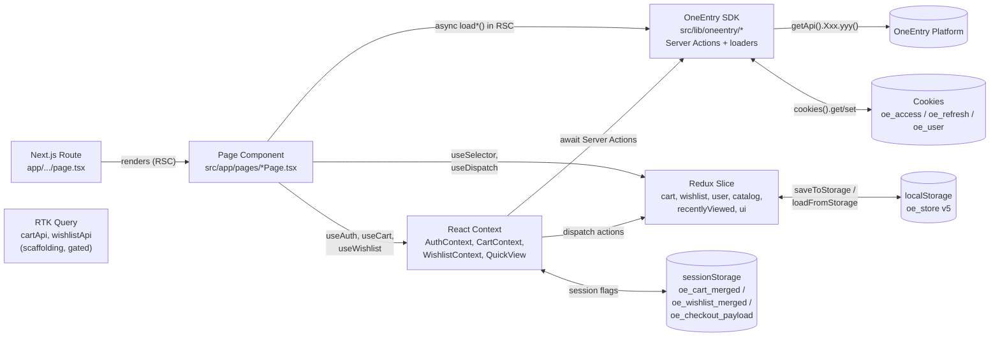

# Architecture — new-shop-nextjs

High-level architecture overview of the OneEntry-backed storefront. Optimized for LLM consumption: short, technical, file-cited.

This document is the top of the documentation pyramid. For deep dives see:
- [ONEENTRY_INTEGRATION.md](./ONEENTRY_INTEGRATION.md) — the full SDK integration surface (env, singleton, markers, endpoints, caches)
- [AUTH.md](./AUTH.md) — sign in / sign up / Google OAuth / bootstrap `/me` / logout
- [REDUX.md](./REDUX.md) — Redux Toolkit store, six slices, two RTK Query APIs
- [CART_WISHLIST.md](./CART_WISHLIST.md) — optimistic Redux + debounced sync + login-time merge + recently-viewed sync
- [CHECKOUT.md](./CHECKOUT.md) — three-step funnel + real order creation + Stripe redirect
- [PRODUCT_DETAIL.md](./PRODUCT_DETAIL.md) — PDP business logic (variant selection, reviews, reserve-in-store, recommendations)
- [ACCOUNT.md](./ACCOUNT.md) — account dashboard (9 tabs + refer-a-friend), Server Actions per tab
- [COMPONENTS.md](./COMPONENTS.md) — registry of every component with role + deep-dive links
- [CATALOG_FILTERS.md](./CATALOG_FILTERS.md) — product list / vector search / filter markers / URL sync
- [DATASETS.md](./DATASETS.md) — remaining static datasets in `src/app/data/`
- [TESTING.md](./TESTING.md) — Vitest, Playwright, Storybook
- [I18N.md](./I18N.md) — locale infrastructure (currently `en_US`)
- [PWA.md](./PWA.md) — service worker + manifest

---

## 1. Tech stack

Sourced from `package.json:19-58`.

| Layer | Library | Version |
|---|---|---|
| Framework | `next` | ^16.2.1 (App Router, React Server Components) |
| UI runtime | `react` / `react-dom` | ^19.2.6 |
| CMS SDK | `oneentry` | ^1.0.154 (`defineOneEntry` / `getApi` — server-side only) |
| State (client) | `@reduxjs/toolkit` | ^2.11.2 |
| State (binding) | `react-redux` | ^9.2.0 |
| Server cache | `@reduxjs/toolkit/query/react` (bundled with RTK) | — |
| Validation | `zod` | ^4.3.6 |
| Styling | `tailwindcss` + `@tailwindcss/postcss` | ^4.3.0 |
| Icons | `@heroicons/react`, `lucide-react` | — |
| Animation utils | `tw-animate-css` | — |
| Diagrams (build-time) | `mermaid`, `remark-gfm` | — |
| Unit tests | `vitest` + `@testing-library/react` + `jsdom` | ^4.1.2 / ^16.3.2 |
| E2E tests | `@playwright/test` / `playwright` | ^1.60.0 |
| Storybook | `storybook` + `@storybook/nextjs-vite` | ^10.3.4 |
| Lint | `eslint` 9 + `eslint-config-next` | — |

Node target: ES2017 (`tsconfig.json:3`). Module resolution: `bundler`. Path alias: `@/*` → `./src/*` (`tsconfig.json:25-28`).

**Notable absences (intentional):** no `next-intl` (single-locale, `DEFAULT_LOCALE = 'en_US'`), no `next-auth` (auth is Server Actions + cookies), no ORM/database driver (all persistent data lives in OneEntry), **no third-party analytics SDK** (`gtag` / `gtm` / `fbq` / `posthog` / `amplitude` / `mixpanel` / `segment` are absent — verified by grep). Instead, the client dispatches to the OneEntry `user-activity/track` endpoint via `trackActivity()` (`src/app/utils/track-activity.ts` → `src/lib/oneentry/activity/actions.ts`).

---

## 2. Directory map

The project uses **dual roots**: `app/` (Next.js routes) and `src/app/` (implementation). Server-only OneEntry code lives under `src/lib/oneentry/`.

### `app/` — Next.js App Router only

`app/` contains only **route entry points** — `page.tsx`, `layout.tsx`, route segment configs, error boundaries, metadata helpers. Route shells delegate to page components imported from `src/app/pages/`.

| Path | Purpose |
|---|---|
| `app/layout.tsx` | Root layout — metadata, viewport, `<Providers>` wrap |
| `app/page.tsx` | Home — JSON-LD organisation/website schema + `<HomePage />` (`export const revalidate = 300` — hard-coded literal; see note on route-shell literals below) |
| `app/[...slug]/page.tsx` | Catch-all — catalog/info pages dispatched via `PAGE_REGISTRY` (`src/app/data/pageRegistry.ts`); `generateMetadata` (`export const revalidate = 60` — hard-coded literal) — ISR for clean URLs, per-request SSR for `searchParams`-carrying requests (filters / sort / pagination) |
| `app/account/page.tsx` | Account dashboard (login-gated) |
| `app/cart/page.tsx` | Cart |
| `app/checkout/{delivery,payment,confirmation}/page.tsx` | Three-step checkout funnel |
| `app/checkout/error.tsx` | Section-scoped error boundary |
| `app/favorites/page.tsx` | Wishlist |
| `app/product/[id]/page.tsx` | Product detail (`export const revalidate = 120` — hard-coded literal; `export async function generateStaticParams() { return []; }` — required in Next.js 16 to activate on-demand ISR for a dynamic segment; without it `revalidate` is silently ignored and every request re-SSRs; critical stock/price validation deferred to a fresh `previewOrderAction` call immediately before `createOrderAction` on the Payment page) |
| `app/new/page.tsx` | New Arrivals (`dynamic = 'force-dynamic'`) |
| `app/sale/page.tsx` | Sale (`dynamic = 'force-dynamic'`) |
| `app/stores/page.tsx` | Store locator (`revalidate = 3600` — ISR) |
| `app/download/filter-system/page.tsx` | Filter system whitepaper |
| `app/offline/page.tsx` | PWA offline fallback page (client component) |
| `app/error.tsx`, `app/not-found.tsx`, `app/loading.tsx` | Route-segment error / 404 / loading |
| `app/manifest.ts` | PWA Web App Manifest |
| `app/robots.ts`, `app/sitemap.ts` | Crawler hints |
| `app/opengraph-image.tsx` | OG image generation |
| `app/llms.txt/route.ts` | AI-crawler documentation endpoint (`dynamic = 'force-static'`) |
| `app/icon.svg`, `app/favicon.ico` | Icons |
| `app/globals.css` | Tailwind entry |

> **Route-shell revalidate must be a literal.** Next.js statically analyses `export const revalidate` at build time and rejects any value that is not a statically-analysable literal — importing a variable from another module (e.g. `import { REVALIDATE_HOME } from 'src/lib/isr'`) causes "Invalid segment configuration export detected" and breaks the production build. The three ISR route shells therefore hard-code the numeric literal directly. The `ISR_*_TTL_SEC` env vars **only** affect `unstable_cache` TTLs inside the individual data loaders — they do not change the route-shell revalidate window. If you adjust a default in `src/lib/isr.ts`, update the corresponding literal in the route file manually.
>
> **`generateStaticParams` is required for ISR on dynamic segments (Next.js 16).** A route with a `[param]` segment that does not export `generateStaticParams` is classified as fully dynamic — `revalidate` is silently ignored and every request re-SSRs. `app/product/[id]/page.tsx` exports `export async function generateStaticParams() { return []; }` to opt the route into on-demand ISR without pre-building any ids at deploy time. This export is load-bearing: removing it reverts the page to fully dynamic even though `revalidate = 120` is present.

### `src/app/` — implementation

| Folder | Purpose |
|---|---|
| `src/app/pages/` | Page components imported by `app/.../page.tsx`. Subfolders `account/`, `cart/`, `checkout/`, `product/`, `favorites/`, `new/`, `sale/`, `stores/` hold per-page composition pieces. Also holds the 8 catalog page shells (`WomenCatalogPage`, `MenShoesPage`, …). |
| `src/app/components/` | ~49 cross-page UI components (Header, HeaderMegaMenu, HeaderTopBar, HeaderSearch, HeaderMobileDrawer, MiniCart, ProductCard, CatalogTemplate, HeroSlider, PageBlocksRenderer, LoginModal, RegisterModal, QuickViewModal, CheckoutStepper, Footer, ErrorBoundary, JsonLd, ServiceWorkerRegistrar, PageViewTracker, Providers, WishlistSyncEffect…). `PageBlocksRenderer.tsx` is the shared `PageBlock[]` → component switch used by every content route (homepage, catalog, info, sale, new, stores, favorites, PDP). The `figma/` subfolder has been removed — `figma/ImageWithFallback.tsx` was a dead duplicate of `ImageWithFallback.tsx` with no importers. |
| `src/app/context/` | React Context providers for transient UI state and per-user session: `AuthContext`, `CartContext`, `WishlistContext`, `QuickViewContext`, `CatalogAccentContext`. |
| `src/app/store/` | Redux Toolkit store + six slices + two RTK Query APIs (see §4 + [REDUX.md](./REDUX.md)). |
| `src/app/store/api/` | `cartApi` and `wishlistApi` (`fetchBaseQuery` slices — currently kept as scaffolding, live sync is done through the Auth Server Actions `syncCart` / `syncWishlist`). |
| `src/app/store/__tests__/` | Vitest unit tests for slices and API slices. |
| `src/app/hooks/` | Reusable hooks: `useAnnounce` (ARIA live regions), `useDragScroll`, `useFocusTrap`. |
| `src/app/utils/` | Pure helpers: `formatPrice`, `colorNames` (hex → name), `colorUtils` (contrast), `schemas` (Zod), `syncWarnings` (custom events), `guest-id` (persistent guest UUID), `track-activity` (client-side wrapper over the activity Server Action). |
| `src/app/actions/` | `auth.ts` has been **deleted** — the `validateCredentials` mock-credentials Server Action it contained has been removed. This directory is currently empty. |
| `src/app/constants/` | `colors.ts` (accent palette), `timings.ts` (delays, TTLs, limits). |
| `src/app/data/` | ~40 static TypeScript datasets — remaining labels, SEO metadata, config, `pageRegistry`, `cms-product-id-map` (string↔number id conversion helpers). See [DATASETS.md](./DATASETS.md). |

### `src/lib/` — SDK + external integrations

| Folder / file | Purpose |
|---|---|
| `src/lib/google-auth.ts` | Google OAuth kick-off helper. Exports `startGoogleOAuth(returnTo?)`, which calls the `getGoogleAuthUrlAction` Server Action and then `window.location.href = url` — the browser leaves for Google's authorize page. The callback lands on `app/auth/callback/google/route.ts`, which invokes `exchangeGoogleCodeAction`. Env: `NEXT_PUBLIC_GOOGLE_CLIENT_ID`. |
| `src/lib/isr.ts` | Central revalidate constants with env overrides via a `ttl(envKey, fallback)` helper. Defaults: `REVALIDATE_HOME=300`, `REVALIDATE_PRODUCT=120`, `REVALIDATE_CATALOG=60`, `REVALIDATE_SALE=60`, `REVALIDATE_NEW=600`, `REVALIDATE_STORES=3600`, `REVALIDATE_INFO=3600`. Each constant reads an optional env var (`ISR_HOME_TTL_SEC`, `ISR_PRODUCT_TTL_SEC`, `ISR_CATALOG_TTL_SEC`, `ISR_SALE_TTL_SEC`, `ISR_NEW_TTL_SEC`, `ISR_STORES_TTL_SEC`, `ISR_INFO_TTL_SEC`). **These constants are consumed exclusively by `unstable_cache`-wrapped loader functions** — they are NOT imported by `app/*/page.tsx`. Route-shell `export const revalidate` must be a statically-analysable literal; importing a computed value causes Next.js to throw "Invalid segment configuration export detected" and break the build. The three main route shells therefore use plain literals (`app/page.tsx` → `300`, `app/product/[id]/page.tsx` → `120`, `app/[...slug]/page.tsx` → `60`) that must be kept in sync with the defaults in this file manually. Setting `ISR_DISABLED=1` collapses all `unstable_cache` TTLs to 1 s; it has no effect on the route-shell literals. |
| `src/lib/oneentry/profiling.ts` | Loader profiling helper. `withTiming(name, fn)` wraps an async loader: no-op when `OE_PROFILE≠1` (returns `fn` unchanged, zero overhead). When `OE_PROFILE=1`, each call logs `[OE-timing] <name> ok <ms>ms` (or `FAIL`) to stdout **and** pushes a `TimingRecord` into a 5000-entry in-memory ring buffer. `OE_PROFILE_SLOW_MS=N` suppresses stdout logs for calls faster than N ms — the ring buffer always captures every call regardless. Exports: `withTiming`, `readTimings()`, `clearTimings()`, `aggregateTimings()`, `TimingRecord`, `TimingAggregate`. The ring buffer is pinned to `globalThis.__oneentryTimingRing__` so that all Next.js server bundles (SSR loaders + the `/api/perf-dump` route handler) share a single instance — without this, bundle splitting would give each bundle its own empty buffer and the endpoint would always return `totalRecords: 0`. The ring buffer is consumed by `app/api/perf-dump/route.ts`. Applied to `loadHeroSlides`, `loadHomepageCollections`, `loadDiscountBanner`, `loadCategorySection`, `loadStores`, `loadProducts`, `loadProductById`, `loadProductsByIds`, `loadFilteredProducts`, `loadProductReviews`, `loadBlockWithProducts`, `loadPageBlocksById`, `loadPageBlocksByUrl`, `loadProductBlocks`, `loadFrequentlyOrderedBlock`, `loadHomepageProductBlock`, `loadPurchaseBonusForProduct`. |
| `app/api/perf-dump/route.ts` | Ops HTTP endpoint that surfaces the profiling ring buffer without shell/log access. `GET /api/perf-dump` → aggregated p50/p95/p99 per loader, sorted by p95 desc. `GET /api/perf-dump?raw=1` → raw record list (up to 5000). `DELETE /api/perf-dump` → clears the buffer. Requires `Authorization: Bearer <PERF_DUMP_TOKEN>` on every request — 401 when the header is absent or `PERF_DUMP_TOKEN` is unset. Returns 409 when `OE_PROFILE≠1`. `export const dynamic = 'force-dynamic'`, `runtime = 'nodejs'` — never cached. |
| `src/lib/oneentry/index.ts` | **SDK singleton.** `defineOneEntry(url, {token})` guarded by `isOneEntryEnabled`. Exports `getApi()` (throws if env missing), `isError()` type guard, `OeError` alias. |
| `src/lib/oneentry/locale.ts` | `DEFAULT_LOCALE = process.env.NEXT_PUBLIC_DEFAULT_LOCALE ?? 'en_US'`. |
| `src/lib/oneentry/system-text.ts` + `SystemText.tsx` | CMS-managed label engine. Loads attribute sets by marker, caches 5 min process-wide + per-request via React `cache()`, provides `t()` and `<SystemText>` for RSC. |
| `src/lib/oneentry/auth/` | All auth Server Actions (`signInAction`, `getGoogleAuthUrlAction`, `exchangeGoogleCodeAction`, `signUpAction`, `signOutAction`, `getCurrentUserAction`, `updateProfileAction`, `updateAddressesAction`, `updateSubscriptionsAction`, `updateConsentAction`, `syncCartAction`, `syncWishlistAction`, `createOrderAction`) + cookie management (`oe_access`, `oe_refresh`, `oe_user`, and the short-lived `oe_google_state` / `oe_google_return_to` CSRF cookies during a Google authorize round-trip). Also `sign-up-form.ts` — attribute-set schema for the registration form and its React context. |
| `src/lib/oneentry/activity/actions.ts` | Server Action posting to `/api/content/user-activity/track` with `x-guest-id` for anonymous users. 10 event types. |
| `src/lib/oneentry/blocks/` | Block loaders: `hero-slides` (marker `hero_slider`), `homepage-collections` (`homepage_collections`), `discount-banner` (`discount_banner`), `homepage-product-blocks`, `category-section` (`category_section`), `page-blocks` — three entry-points: `loadPageBlocksById(pageId)` (used by the homepage, id=1), `loadPageBlocksByUrl(pageUrl)` (used by catalog / info / sale / new / stores / favorites routes — `pageUrl` is the OE marker, e.g. `women_clothing` or `sale`), `loadProductBlocks(productId)` (used by the PDP). All three resolve each block marker through `loadBlockWithProducts` and return a sorted `PageBlock[]`. Fallback: when a `similar_products_block` returns no items, `loadHomepageBlockFallback` maps markers `homepage_new_arrivals` / `homepage_best_sellers` / `homepage_sale` to product labels `NEW` / `BESTSELLER` / `SALE` and pulls tagged products via `loadProducts({ tags: [label] })`; unknown markers stay empty so the block hides silently. |
| `src/lib/oneentry/catalog/` | Products list + vector/quick search + variant aggregation (`products.ts`); page-by-URL loader (`pages.ts`, normaliser accepts wrapped + flat `attributeValues`); seasonal-trend page → attribute-filter override (`seasonal-trend.ts` — `resolveSeasonalTrend` / `applySeasonalTrend`); reviews via form-data (`reviews.ts`); stores + store-locations page (`stores.ts`, `store-locations-page.ts`); URL ↔ marker filter mapping (`filters.ts`); Server-Action wrappers (`products-action.ts`, `search-action.ts`); service maintenance requests (`service-requests-action.ts`, `service-request-submit-action.ts`); waiting list (`waiting-list-action.ts`); shared UI-adapter (`adapt.ts`). |
| `src/lib/oneentry/forms/` | `placeholders.ts` (CMS-managed form copy loader), `FormPlaceholdersContext.tsx`, `submit.ts` (Server Action for arbitrary form-data POSTs). |
| `src/lib/oneentry/labels/` | 12 label sets — each pair `{name}-labels.ts` (loader) + `{name}-types.ts` (typed dict): `product-card`, `sign-in`, `create-account`, `checkout`, `your-bag`, `pdp`, `favorites-page`, `new-arrivals-page`, `sale-page`, `stores`, `account`, `interface-controls`. Each has a matching client-side React context provider consumed under `<Providers>`. |
| `src/lib/oneentry/menus/` | `menus.ts` (`getMenusByMarker`), `adapt-header.ts` + `adapt-footer.ts` (OE menu tree → storefront mega-menu shape), `HeaderMenuContext.tsx`, `FooterMenuContext.tsx`. |
| `src/lib/oneentry/payments/accounts.ts` | `getPaymentAccountsAction` — reads visible payment accounts from `Payments.getAccounts` (Stripe / custom types). |

### `src/` (non-`app`)

| Folder | Purpose |
|---|---|
| `src/assets/` | Static image assets (Figma-exported, optimized) |
| `src/imports/` | Generated Figma component imports |
| `src/stories/` | Storybook stories |

### Project root

| Path | Purpose |
|---|---|
| `public/sw.js` | Service worker (precache + offline fallback) |
| `public/offline.html` | Static offline shell served by `sw.js` when navigation fails |
| `public/icons/` | PWA icons (32, 192, 512, apple-touch) |
| `e2e/` | Playwright specs (`playwright.config.ts`) |
| `.storybook/` | Storybook config |
| `scripts/` | One-off maintenance scripts (`setup-demo-passwords.sh`) |
| `agents_datasets/` + `.claude/` | Blueprint pipeline rules — unrelated to runtime; used by the OneEntry blueprint generator |

---

## 3. Data flow

The storefront has four orthogonal state layers; a request flows through them in order.

**Concrete walk-through — a catalog page render:**

1. Next.js matches `app/[...slug]/page.tsx`, awaits `params.slug`, looks up `PAGE_REGISTRY[path]` (`src/app/data/pageRegistry.ts`) and picks a page component key (`WomenCatalogPage`, `MenShoesPage`, `InfoPage`, …).
2. `generateMetadata()` on the same route composes SEO metadata from the local `SEO` map in `src/app/data/seoData.ts` — currently there is no CMS lookup for page titles (though the `loadPageByUrl` loader exists in the SDK layer as unused scaffolding, retained for future info-page CMS wiring).
3. The catalog page RSC calls `loadProducts({ pageUrl, filters, sort, page, langCode })` from `src/lib/oneentry/catalog/products.ts`. That helper calls `getApi().Products.getProductsByPageUrl` (or the vector/quick search endpoints when there is a query) with a filter body constructed by `catalog/filters.ts` (URL string params → OE marker payload).
4. `<CatalogTemplate>` renders on the client and reads `state.catalog[catalogKey]` from `catalogSlice` for filter/sort/view state; `state.wishlist` decides which cards show a filled heart.
5. The header consumes `useAuth()` (`src/app/context/AuthContext.tsx`) — which was seeded on mount by `getCurrentUserAction()` (Server Action). Cart / wishlist icons show `state.cart` / `state.wishlist` counts.
6. When the user adds to cart, `CartContext.addItem` dispatches to `cartSlice` (optimistic). A separate effect debounces 400 ms and calls `syncCart(oeItems)` — a Server Action that PUTs `/users/me/cart`.
7. Client-persisted Redux slices (cart, wishlist, recentlyViewed, catalog) are mirrored to `localStorage` under key `oe_store` with `__version: 5` — see `src/app/store/index.ts`. A versioned migration chain runs on load (`MIGRATIONS` in the same file).

---

## 4. State layers

Four tiers with distinct responsibilities. Never duplicate state across tiers.

### 4.1 OneEntry SDK (server-side truth)

All server-authoritative data — products, pages, blocks, menus, labels, user profile, orders, payment accounts, reviews, forms — comes from `src/lib/oneentry/`. Most fetchers wrap `getApi().Xxx.yyy(marker, langCode)` and memoize with React `cache()` for the current request. Homepage block loaders (`loadHeroSlides`, `loadHomepageCollections`, `loadDiscountBanner`, `loadCategorySection`) and `loadStores` use Next.js `unstable_cache` instead — persistent cross-request storage keyed by `(lang)`, tagged `oe-block` / `oe-stores` for on-demand webhook invalidation, with TTLs from `src/lib/isr.ts`. Other high-traffic reads (attribute sets, product lists) add a process-wide 5-minute TTL. Server Actions (files marked `'use server'`) handle mutations (login, signup, order, sync-cart, sync-wishlist, submit-form) and cookie state. Env gate: `isOneEntryEnabled = Boolean(ONEENTRY_URL && ONEENTRY_TOKEN)`; `getApi()` throws loudly if missing.

### 4.2 React Context — session + UI conveniences

`src/app/context/` providers, all `'use client'`:

| Context | Holds |
|---|---|
| `AuthContext` | `isLoggedIn`, `user` (merged from `getCurrentUserAction`), `authReady` flag (false until bootstrap `/me` completes), login/register modal state, and 11 mutation callbacks that delegate to `src/lib/oneentry/auth/actions.ts` (`login`, `startGoogleOAuth`, `signUp`, `logout`, `updateUser`, `updateProfile`, `updateAddresses`, `updateSubscriptions`, `updateConsent`, `syncCart`, `syncWishlist`). `startGoogleOAuth` is fire-and-navigate — it triggers `getGoogleAuthUrlAction` then redirects the browser to Google; the result comes back through the `app/auth/callback/google` route. The remaining auth Server Actions (`exchangeGoogleCodeAction`, `getCart` / `getWishlist`, `pushRecentlyViewed` / `getRecentlyViewed` / `mergeRecentlyViewed`, `createOrder`) are imported and called directly — `exchangeGoogleCodeAction` from the callback route, the rest from components. |
| `CartContext` | Typed facade over `cartSlice`; hydrates from `user.cartItems` on login (via `oe_cart_merged` sessionStorage flag) and pushes a debounced 400 ms `syncCart()` on every change. |
| `WishlistContext` | Same pattern for wishlist. Also enriches placeholder items with product data via `getProductsByIdsAction`. |
| `QuickViewContext` | Quick-view modal open state + currently previewed product (dispatches to `uiSlice.quickView`). |
| `CatalogAccentContext` | Active catalog accent colour (used to tint the catalog hero + filter chips). |

Contexts are nested inside `<Provider store={...}>` in `src/app/components/Providers.tsx`.

### 4.3 Redux slices — optimistic client state

Configured in `src/app/store/index.ts`:

| Slice | Persisted? | Purpose |
|---|---|---|
| `cart` | ✅ (except `miniCartOpen`) | Cart items + mini-cart open flag |
| `wishlist` | ✅ | Wishlist items |
| `recentlyViewed` | ✅ | Recently-viewed products with `viewedAt` timestamp — TTL 30 days, max 100 |
| `catalog` | ✅ | Per-catalog filter + sort + view-mode + active-chip state |
| `user` | ❌ | Loyalty defaults + `authToken`/`refreshToken`/`userIdentifier` (empty by design; real session lives in httpOnly cookies) |
| `ui` | ❌ | Transient quick-view + mobile-menu state |

Migrations live in `MIGRATIONS` (`src/app/store/index.ts`) — current schema version is `5`. Catalog state is hydrated **after** client mount via `loadCatalogFromStorage()` to avoid SSR hydration mismatch.

### 4.4 RTK Query — scaffolded, gated

`src/app/store/api/`:

| Slice | Mode |
|---|---|
| `cartApi` | `fetchBaseQuery({ baseUrl: process.env.NEXT_PUBLIC_API_URL })` with `Authorization: Bearer <state.user.data.authToken>`. Kept as a wire-ready scaffold; **the live cart sync path uses the `syncCart` Server Action, not this slice.** Gated by `isCartApiEnabled()`. |
| `wishlistApi` | Same pattern. Gated by `isWishlistApiEnabled()`. |

Both middlewares are still concatenated in `makeStore()` so hooks continue to compile, but current UI does not call the query hooks. Details in [REDUX.md](./REDUX.md).

---

## 5. Server vs Client rendering

### Server-rendered
- All `app/.../page.tsx` route entry files (SSR / RSC).
- SEO `metadata` exports per route + dynamic `generateMetadata()` in `app/[...slug]/page.tsx` and `app/product/[id]/page.tsx`.
- JSON-LD structured data injected via `<JsonLd>` (`src/app/components/JsonLd.tsx`).
- All `src/lib/oneentry/**/*.ts` loaders and Server Actions.
- `<SystemText>` labels rendered in RSC.
- `app/manifest.ts`, `app/sitemap.ts`, `app/robots.ts`, `app/opengraph-image.tsx`, `app/llms.txt/route.ts`.

`app/layout.tsx` (RSC) runs on every request and awaits **8 loaders in parallel** — 5 label sets (product-card, sign-in, create-account, interface-controls, your-bag), 2 menu markers (`header`, `footer`), and the sign-up form schema. The results are passed as props into `<Providers>`, which then hands them to the corresponding React contexts. The layout also inlines a small script that swallows a React 19 dev-only `performance.measure()` regression — production builds are unaffected.

### Client-rendered (`'use client'`)
- `src/app/components/Providers.tsx` and everything it wraps (Redux store cannot live on the server).
- All `src/app/context/*` providers + the OneEntry label + menu contexts under `src/lib/oneentry/{labels,menus,forms,auth}/*Context.tsx`.
- All interactive components (Header, MiniCart, ProductCard, CatalogTemplate, LoginModal, RegisterModal, QuickViewModal, checkout pages, etc.).
- All `src/app/pages/*Page.tsx` (they consume Redux + Context).

The architectural rule: route shells stay on the server for SEO + initial HTML; everything below `<Providers>` is client-only.

### Provider layering — global vs route-scoped

**Global** — mounted by `<Providers>` under `app/layout.tsx`, available to every page:

- `<Provider store>` (Redux) → `<ServiceWorkerRegistrar>` → ARIA live regions (`#aria-live-polite`, `#aria-live-assertive` — the sink for `useAnnounce()`) → `<AuthProvider>` → `<WishlistSyncEffect>` (no-op placeholder) → `<PageViewTracker>` → 5 label contexts (`ProductCardLabelsProvider`, `SignInLabelsProvider`, `CreateAccountLabelsProvider`, `InterfaceControlsLabelsProvider`, `YourBagLabelsProvider`) → `<FooterMenuProvider>` → `<HeaderMenuProvider>` → `<SignUpFormSchemaProvider>` → `<ErrorBoundary>` → `{children}`

**Route-scoped** — each mounted by the corresponding `app/*/page.tsx` shell (loaded on demand):

| Provider | Route |
|---|---|
| `AccountLabelsProvider` | `/account` |
| `CheckoutLabelsProvider` | `/cart`, `/checkout/*` |
| `NewArrivalsPageLabelsProvider` | `/new` |
| `FavoritesPageLabelsProvider` | `/favorites` |
| `SalePageLabelsProvider` | `/sale` |
| `StoresLabelsProvider` | `/stores` |
| `PdpLabelsProvider` | `/product/[id]` |
| `CartContext` / `WishlistContext` / `QuickViewContext` | not React contexts — hook-only facades; safe to use anywhere below `<Providers>` |

Splitting label providers per route keeps the initial payload smaller — attribute-set loads for `/account` don't run on the homepage, etc.

---

## 6. PWA layer (brief)

Three pieces:

1. **Web App Manifest** — `app/manifest.ts` exposes name / short_name / icons / theme_color / start_url at `/manifest.webmanifest`. Categories: shopping, fashion, lifestyle.
2. **Service worker** — `public/sw.js` (precache + offline fallback). Registered client-side from `src/app/components/ServiceWorkerRegistrar.tsx`, mounted inside `Providers`.
3. **Offline route** — `app/offline/page.tsx` and `public/offline.html` (static fallback served by `sw.js` when network is unreachable).

Deeper coverage in [PWA.md](./PWA.md).

---

## 7. Build / dev / test commands

From `package.json`:

| Command | What it does |
|---|---|
| `yarn dev` | `next dev` — local dev server |
| `yarn build` | `next build` — production build |
| `yarn start` | `next start` — production server |
| `yarn lint` / `yarn lint:fix` | ESLint on `src` and `app` |
| `yarn test` | `vitest run` — unit/component tests (jsdom) |
| `yarn test:watch` | `vitest` watch mode |
| `yarn test:e2e` | `playwright test` — E2E suite (see [E2E-TESTS.md](./E2E-TESTS.md)) |
| `yarn test:e2e:ui` / `yarn test:e2e:headed` | Playwright UI / headed mode |
| `yarn storybook` | Storybook dev (port 6006) |
| `yarn build-storybook` | Static Storybook build |

Configs: `next.config.ts`, `vitest.config.ts` (with `vitest.shims.d.ts`), `playwright.config.ts`, `.storybook/`, `eslint.config.mjs`, `postcss.config.mjs`, `tsconfig.json`.

### `next.config.ts` — notable choices

- `reactStrictMode: true`, `poweredByHeader: false`, `compress: true`.
- `experimental.optimizePackageImports: ['lucide-react', '@heroicons/react/24/outline', '@heroicons/react/24/solid']` — trims ~200 KB from first-load JS by tree-shaking the icon bundles.
- `images.unoptimized: true` — Next.js image optimization is **disabled**. Reason: OE's CDN already serves reasonably-sized preview JPEGs, and the `/_next/image` proxy was aborting concurrent requests in production. Every `<Image>` in the codebase therefore serves the CDN URL directly.
- `images.remotePatterns` — `images.unsplash.com` + `**.oneentry.cloud` (kept for the case where a component opts back into optimization via `unoptimized={false}`).
- `headers()` — long-lived cache (`max-age=86400`, `stale-while-revalidate=604800`) for `/images/*`.

### `scripts/` — build tooling

Not part of the runtime bundle. Consumed by the CMS blueprint pipeline and demo bootstrap.

| Script | Purpose |
|---|---|
| `setup-demo-passwords.sh` | One-off bcrypt of `demo123` into the six `seed-demo-user-*` records + bootstrap of the `email` auth provider, attribute set, and form. Idempotent. See [DEMO_LOGIN.md](./DEMO_LOGIN.md). |
| `build-blueprint.mjs` | Transforms `blueprint.example.json` → `blueprint.json` — patches `users_auth_providers.type: 'password' → 'email'`, sets `orders_storage.price_expiration = '10m'`, populates `forms[*].attributes_sets.en_US`, drops the `@osp.card` trap, etc. |
| `generate-blueprint.ts` | Reads legacy `src/app/data/{women,men}-{clothing,bags,shoes,accessories}.ts` product datasets and produces `blueprint.from-datasets.json` — used as input to `build-blueprint.mjs`. Run with `npx tsx scripts/generate-blueprint.ts`. |
| `build-oedata.mjs` | Materializes the `.oedata-workspace/OEdata.draft*.json` master into per-domain TS files under `src/app/OEdata/`. Deterministic / idempotent. |

The blueprint scripts are supporting artefacts for the OneEntry blueprint pipeline described in `agents_datasets/rules/usage-guide.md`; the storefront runtime does not read them.

---

## 8. Cross-references

| Need to know about… | Read |
|---|---|
| All static datasets and their shapes | [DATASETS.md](./DATASETS.md) |
| Slice-by-slice Redux internals | [REDUX.md](./REDUX.md) |
| Vitest + Playwright + Storybook | [TESTING.md](./TESTING.md) |
| Auth flow (Server Actions + cookies + `/me` bootstrap) | [AUTH.md](./AUTH.md) |
| OneEntry Platform SDK wiring | [ONEENTRY_INTEGRATION.md](./ONEENTRY_INTEGRATION.md) |
| Cart + wishlist sync semantics | [CART_WISHLIST.md](./CART_WISHLIST.md) |
| Three-step checkout funnel + real order + Stripe | [CHECKOUT.md](./CHECKOUT.md) |
| Multi-locale strategy | [I18N.md](./I18N.md) |
| Service worker, manifest, offline | [PWA.md](./PWA.md) |
| Catalog filter engine + variant selection | [CATALOG_FILTERS.md](./CATALOG_FILTERS.md) |
| Filter UI layout / sticky block | [FILTER_SYSTEM.md](./FILTER_SYSTEM.md) |
| SEO checklist + JSON-LD + AI crawlers | [SEO_OPTIMIZATION.md](./SEO_OPTIMIZATION.md) |
| Demo accounts + Platform setup | [DEMO_LOGIN.md](./DEMO_LOGIN.md) |
