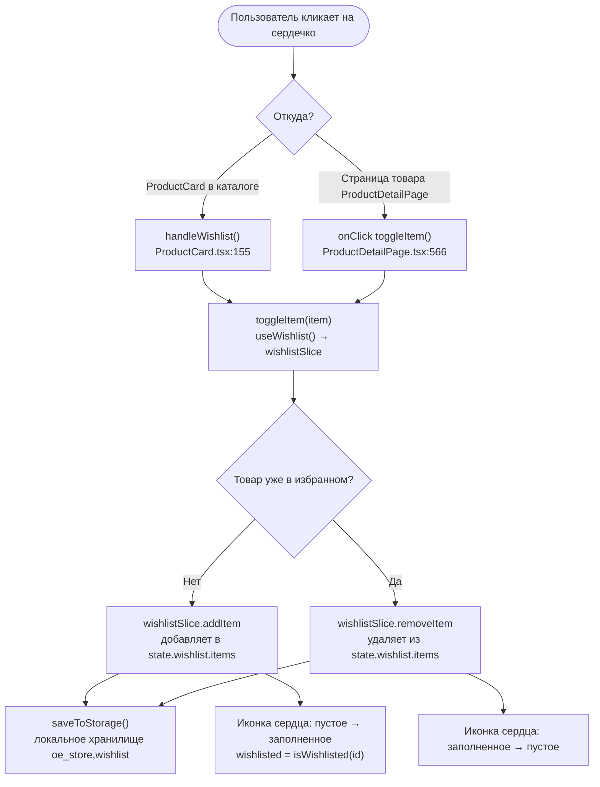
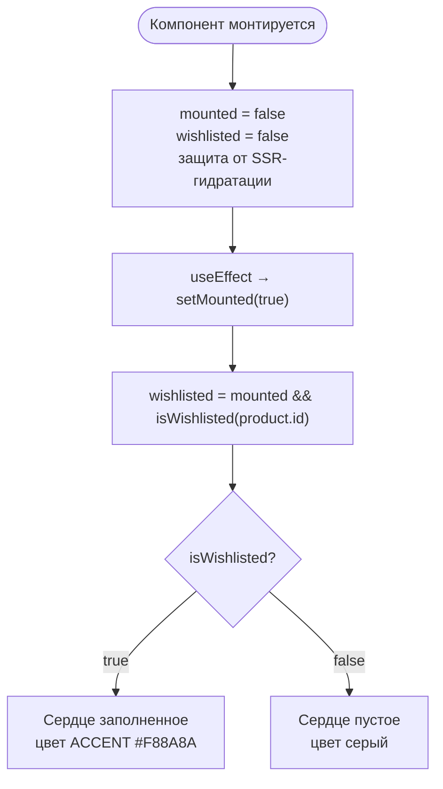
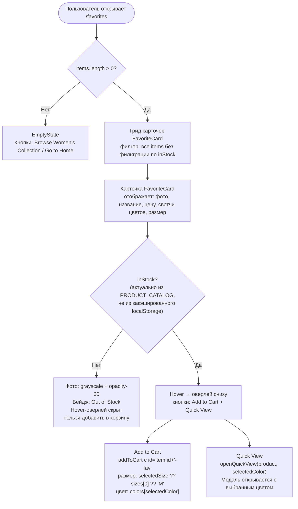
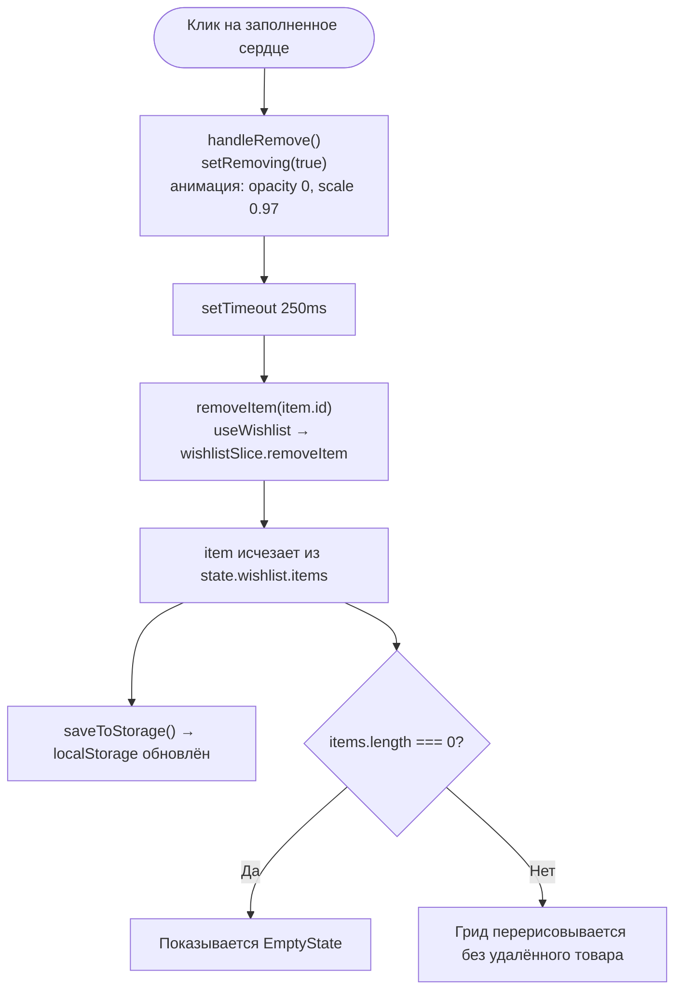
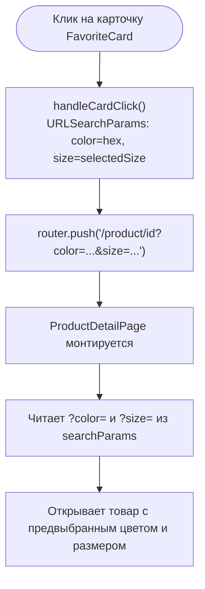
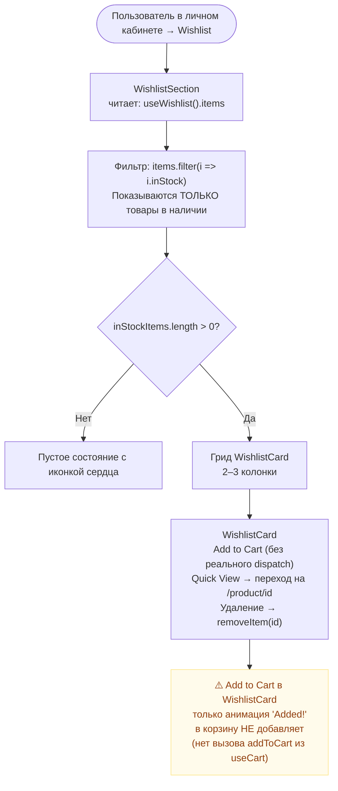
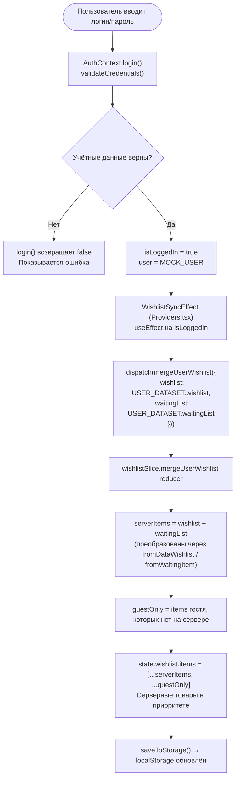
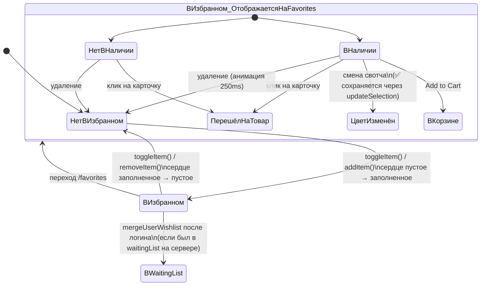
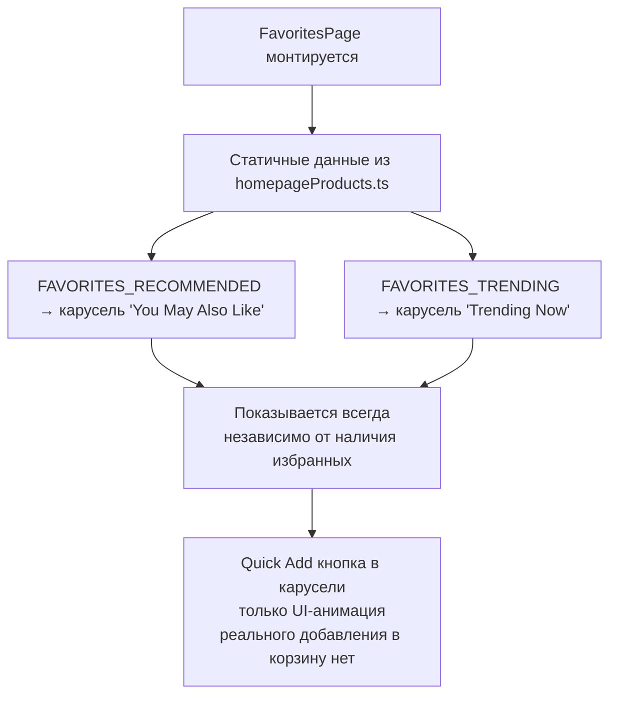

# Избранное — полная схема функционала

## Источники данных

- **Redux store** → `state.wishlist.items: WishlistItem[]`
- **localStorage** → ключ `oe_store` → поле `wishlist` (автосохранение при каждом dispatch)
- **userData.ts** → `USER_DATASET.wishlist` + `USER_DATASET.waitingList` (серверные данные после логина)

---

## 1. Добавление / удаление из избранного



**Что передаётся в `toggleItem`:**
- `id` — идентификатор товара
- `name`, `brand`, `price`, `salePrice`, `image`
- `colors[]` — массив hex-значений цветов
- `colorStock[]` — доступность каждого цвета (тот же индекс)
- `sizes[]`
- `badge` — метка (SALE, NEW и т.д.)
- `inStock` — общая доступность товара
- `selectedColor` — hex выбранного цвета в момент добавления

---

## 2. Определение состояния кнопки сердца



---

## 3. Страница /favorites — FavoritesPage



---

## 4. Смена цвета в FavoriteCard

```mermaid
flowchart TD
    A([Клик на свотч цвета]) --> B{colorStock[idx] === false\nили !item.inStock?}

    B -->|Да — OOS| C["Ничего не происходит\nСвотч: opacity-60, cursor-not-allowed\nЗачёркивание по диагонали"]
    B -->|Нет — доступен| D["setSelectedColor(idx)\nлокальный state"]

    D --> E["updateSelection(item.id, item.colors[idx])\nсохраняется в Redux + localStorage"]
```

> **Задача #24** — исправлено: после `setSelectedColor(idx)` вызывается
> `updateSelection(item.id, item.colors[idx])` — цвет сохраняется в localStorage.

---

## 5. Удаление из FavoritesPage



---

## 6. Переход на карточку товара из Favorites



---

## 7. Страница /account?tab=wishlist — WishlistSection



---

## 8. Синхронизация после логина



---

## 9. Персистентность: сохранение и загрузка

```mermaid
flowchart TD
    A["Любой dispatch в wishlistSlice"] --> B["store.subscribe() → saveToStorage()"]
    B --> C["localStorage['oe_store'] = JSON.stringify({\n  wishlist: state.wishlist,\n  ...\n})"]

    D([Пользователь открывает сайт заново]) --> E["makeStore() → loadFromStorage()"]
    E --> F{localStorage['oe_store'] существует?}
    F -->|Нет| G["Пустой wishlist"]
    F -->|Да| H["Читает __version, запускает миграции"]
    H --> I["preloadedState.wishlist = сохранённые данные"]
    I --> J["Redux store инициализирован с сохранёнными избранными"]
    J --> K["Пользователь видит свои избранные сразу\nбез запроса к серверу"]
```

---

## 10. Полная карта состояний WishlistItem



---

## 11. Рекомендации и Trending на /favorites


